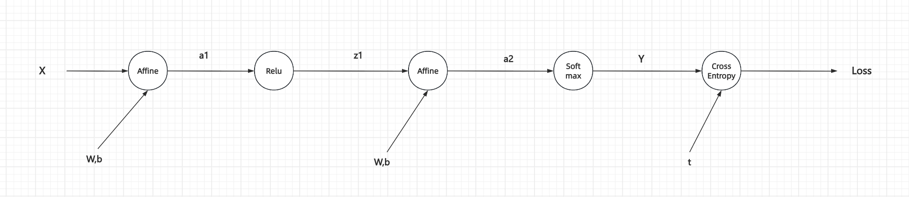

## Demo

说一下backward函数写法的一些技巧
- backward的过程和forward正好相反
- 所以，参数也是反的。
  - forward的输出，output variable，是backward的input variable, 语义是derivative with output variables.
  - forward的输入，local variable，是backward的output variable，语义是derivative with input variables.

forward是复合函数由里向外的过程，backward则是复合函数由外向里的过程。
- 由里向外，其实就是函数的计算过程。
- 由外向里，是导数的计算过程。

```python
class MulLayer:
    def __init__(self):
        self.x = None
        self.y = None

    def forward(self, x, y):
        self.x = x
        self.y = y
        out = x * y
        return out

    # On the other hand, backward multiplies the derivative from the upstream(dout)
    # by the reserved value of forward propagation and passes the result downstream.
    def backward(self, dout):
        dx = dout * self.y
        dy = dout * self.x
        return dx, dy

def test_apple_price():
    apple = 100
    apple_num = 2
    tax = 1.1

    # Layer
    mul_apple_layer = MulLayer()
    mul_tax_layer = MulLayer()

    # forward
    apple_price = mul_apple_layer.forward(apple, apple_num)
    price = mul_tax_layer.forward(apple_price, tax)

    print(f"apple price: {apple_price}, tax price: {price}")

    # backward
    # You can use backward() to obtain the differential of each variable.
    dprice = 1
    dapple_price, dtax = mul_tax_layer.backward(dprice)
    dapple, dapple_num = mul_apple_layer.backward(dapple_price)
    print(f"dapple price: {dapple_price}, dtax: {dtax}")
    print(f"dapple: {dapple}, dapple_num: {dapple_num}")
```

## Affine

这个算子也简单说下，根据demo的讨论
- forward的输入是x，这个是backward的输出。这意味着backward需要对谁求导
- backward的输入自然是dout

1. 这里的疑问是，dw,db并不是forward输入，为什么要对他们求导？能问出这个问题，证明对DL的理解不到位。
2. 我们这里求导数，到底是在干什么？前面讲了太多求导技巧，以至于把最关键的问题搞混了。

我们求导的根本目的不还是通过SGD这种启发式方法，来更新参数吗？所以，dW,dB是一定需要求的！！！这个没有疑问。反过来，该问的是，为什么要求dx?
- y = x * w + b
- 还是从公式上来说，我们拍平了看，是不是y = x1 * x2 + x3，那么，如果需要反向传播，是不是需要对所有x1,x2,x3都求partial derivative.
- 所以，你看backward，就是把dx,dw,db全部求出来。dx直接返回了，dw,db都缓存了。

```python
class Affine:
    """
    Affine (Fully Connected) Layer.

    Performs linear transformation: out = x · W + b
    where:
    - x is input from previous layer (batch of samples)
    - W is weight matrix (learnable parameters)
    - b is bias vector (learnable parameters)

    This layer is the fundamental building block of neural networks,
    connecting all neurons between layers.
    """

    def __init__(self, W, b):
        """
        Initialize Affine layer with weights and bias.

        Args:
            W: Weight matrix of shape (input_dim, output_dim)
               Each column represents weights for one output neuron
            b: Bias vector of shape (output_dim,)
               Bias term added to each output neuron
        """
        # Learnable parameters
        self.W = W  # Weights connecting input to output
        self.b = b  # Bias terms

        # Cache variables for backward pass
        self.x = None  # Store input from forward pass (used to compute gradients)
        self.dW = None  # Gradient of loss with respect to weights
        self.db = None  # Gradient of loss with respect to bias

    def forward(self, x):
        """
        Forward pass: Compute output = x @ W + b

        Args:
            x: Input data of shape (batch_size, input_dim)
               Each row is one training sample

        Returns:
            out: Output of shape (batch_size, output_dim)
                 Each row is the transformed feature vector for one sample

        Mathematical formula:
            out_ij = Σ_k x_ik * W_kj + b_j
        """
        # Cache input for backward pass (needed to compute dW)
        self.x = x

        # Linear transformation: (batch_size, input_dim) @ (input_dim, output_dim)
        # Result shape: (batch_size, output_dim)
        # Add bias broadcasting: bias (output_dim,) is added to each row
        out = np.dot(x, self.W) + self.b
        return out

    def backward(self, dout):
        """
        Backward pass: Compute gradients and propagate error backwards.

        Args:
            dout: Gradient of loss with respect to output
                  Shape: (batch_size, output_dim)

        Returns:
            dx: Gradient of loss with respect to input
                Shape: (batch_size, input_dim)
                Propagated to previous layer

        Gradients computed:
            dW: Gradient for weight update (batch_size, output_dim)
            db: Gradient for bias update (output_dim,)

        Mathematical derivations:
            Let L be loss function.
            Given: dout = ∂L/∂out

            ∂L/∂x = ∂L/∂out · ∂out/∂x = dout · W^T
            ∂L/∂W = x^T · dout
            ∂L/∂b = Σ(dout) over batch dimension (axis=0)
        """
        # Compute gradient with respect to input (for backpropagation to previous layer)
        # dx = dout * W^T
        # Shape: (batch_size, output_dim) @ (output_dim, input_dim) = (batch_size, input_dim)
        dx = np.dot(dout, self.W.T)

        # Compute gradient with respect to weights
        # dW = x^T * dout
        # Shape: (input_dim, batch_size) @ (batch_size, output_dim) = (input_dim, output_dim)
        self.dW = np.dot(self.x.T, dout)

        # Compute gradient with respect to bias
        # db = Σ(dout) over batch samples (axis=0)
        # Shape: (output_dim,)
        # We sum because bias is shared across all samples in the batch
        self.db = np.sum(dout, axis=0)
```

## 梯度计算

看下面代码，其实上一章已经讨论过了，这里我再讨论一下。

- loss_W当中，lambda函数体，并没有真的使用将lambda参数传入，看起来不需要。但内部是使用的，这里只是形式。
- loss_W = f(theta, x, t)，至于到底是谁的函数，其实取决于你希望它是谁的函数。
- 在numerical_gradient_nd的计算当中，我们其实可以看出来。这个函数 ```numerical_gradient_nd(f, x)```
  - 自变量是x，意味着会对x进行取增量，然后计算微分
  - ```numerical_gradient_nd(loss_W, self.params['W1'])``` 从实际调用中，可以看出来，```x = self.params['W1']```
  - 所以，自变量是W1
  - 带入sample(x, t)也是重要的，这样loss_w的形式才能最终定下来。

```python
    def gradient_numerical(self, x, t):
        grads = {}

        loss_W = lambda W: self.loss(x, t)

        grads['W1'] = numerical_gradient_nd(loss_W, self.params['W1'])
        grads['b1'] = numerical_gradient_nd(loss_W, self.params['b1'])
        grads['W2'] = numerical_gradient_nd(loss_W, self.params['W2'])
        grads['b2'] = numerical_gradient_nd(loss_W, self.params['b2'])

        return grads
```

以上，其实我之前一直忽略了一点，就是在training的时候，我们计算loss，**本质也是一次forward**

## Why layers?

另一篇里面，讲了一下layers这个术语的差异。在computation graph里面，layer是一个功能比较泛的术语

- operations
- activations
- normalization
- loss

以上几种操作，在计算图里面，统一理解为一个个计算节点。

所以，NN网络的组织就会发生变化

```python
class ImageRecognizerNN():
    ## ---------------------------- Basic method for ImageRecognizer-----------------------------------
    def __init__(self, input_size, hidden_size, output_size, weight_init_std = 0.01, learning_rate=0.1, iterations=10000, batch_size=100):
        # Model parameters.
        self.input_size = input_size
        self.hidden_size = hidden_size
        self.output_size = output_size
        self.model = {}
        self.model['W1'] = weight_init_std * np.random.randn(input_size, hidden_size)
        self.model['b1'] = np.zeros(hidden_size)
        self.model['W2'] = weight_init_std * np.random.randn(hidden_size, output_size)
        self.model['b2'] = np.zeros(output_size)
    
    def predict(self, x):
        a1 = np.dot(x, self.model['W1']) + self.model['b1']
        z1 = sigmoid(a1)

        a2 = np.dot(z1, self.model['W2']) + self.model['b2']
        y = softmax(a2)
        return y
```

```python
class TwoLayerNet():
    ## ---------------------------- Basic method for TwoLayerNet -----------------------------------
    def __init__(self, input_size, hidden_size, output_size, weight_init_std=0.01):
        # Initialize weights.
        self.params = {}

        self.params['W1'] = weight_init_std * np.random.randn(input_size, hidden_size)
        self.params['b1'] = np.zeros(hidden_size)
        self.params['W2'] = weight_init_std * np.random.randn(hidden_size, output_size)
        self.params['b2'] = np.zeros(output_size)

        # Create layers(functional units).
        # 这里相当于把计算节点也抽象出来了
        # 对比my_training.py的实现 forward过程在predict中显示编码实现
        # 这里把forward过程抽象到layers当中
        self.layers = OrderedDict()
        self.layers['Affine1'] = Affine(self.params['W1'], self.params['b1'])
        self.layers['Relu1'] = Relu()
        self.layers['Affine2'] = Affine(self.params['W2'], self.params['b2'])

        # The SoftmaxWithLoss layer combines softmax + loss calculation and is only used during training。
        # Same result - For classification, the predicted class is identical
        # 所以，这里单独放了一层。infer的时候不需要，只有training才需要。
        self.last_layer = SoftmaxWithLoss()

    def predict(self, x):
        # For inference in the network, the output of the final affine layer is used in the inference result.
        # The unnormalized output result from a network is sometimes called a score.
        # To obtain only one answer in neural network inference, you only need to calculate the maximum score.
        # So, you do not need a softmax layer.
        # However, you do need a softmax layer in neural network training.
        for layer in self.layers.values():
            x = layer.forward(x)

        return x
```

可以显著对比predict方法的实现
- a1/a2的计算，其实是相同的方式，如果这里有100层，难道也要显示的写100个矩阵计算吗？所以，这里对于affine的抽象是必要的
  - 计算过程一样，抽象成Affine算子
  - 不同layer(这是网络的layer，不是计算图的layer)，矩阵参数不同，传入不同的参数即可。其实，这里，矩阵参数在Affine算子当中，有点像超参。注意，不是网络的超参。
  - 输入就是x，输出就是a
- z1/z2的计算过程，也是一样的。所以，也抽象
  - hidden layer都是Relu
  - last layer都是softmax(分类问题都是这样)
- 对于forward过程，其实softmax不需要，所以第二版没有计算，节省算力，latency
- 对于backward过程，需要soft max with loss，所以多一层，用在training.

## Backward propagation

Goal: Adjust the weights to minimize the loss.

How: We need to know how much each weight contributed to the error and whether increasing or decreasing it would reduce the loss.

Backpropagation is the algorithm that efficiently computes that contribution (the gradient) for every weight in the network, working backwards from the output layer to the input layer.

经历过数值微分的求导过程，对于BP，其实我们就好理解了。
- 数学层面，这一系列计算，本质是一个复合函数。
- forward过程，从里到外。backward过程，从外到里。
  - 内部或者左侧的导数计算，依赖外部右侧的导数。
  - 所以，为了避免导数重复计算，从外向里，也即从右到左进行计算。

又，复合函数每一步的计算，都被抽象成了functional units，也即计算图中的layer。所以，对于layer来说，需要支持两个方法
- forward：对输入变量，完成计算。
- backward：对输入变量，完成导数计算
- 同时，我们观察到，在forward计算中，可以顺带计算对自变量的导数，保存下来。这个很高效。
- 等backward计算时，upstream导数传递过来，乘以本层自变量的导数，再传递给下游。本层自变量导数在foward已经保存好，所以非常高效。

下面，我们对比backward过程

我们先分析numerical的计算方式
- 首先，需要对所有参数完成计算。参数有4个W1/W2/b1/b2
- 其次，定义好loss function。否则，无法确定参数对于loss function的影响。
- 然后，开始计算导数。计算方式，采用数值微分的办法。
- 最后，返回

```python
    # calculate gradient for all parameters.
    def gradient_numerical(self, x, t):
        grads = {}

        loss_W = lambda W: self.loss(x, t)

        grads['W1'] = numerical_gradient_nd(loss_W, self.model['W1'])
        grads['b1'] = numerical_gradient_nd(loss_W, self.model['b1'])
        grads['W2'] = numerical_gradient_nd(loss_W, self.model['W2'])
        grads['b2'] = numerical_gradient_nd(loss_W, self.model['b2'])

        return grads
```

然后，我们看BP的方法

```python
    def loss(self, x, t):
        y = self.predict(x)
        return self.last_layer.forward(y, t)

    def predict(self, x):
        # For inference in the network, the output of the final affine layer is used in the inference result.
        # The unnormalized output result from a network is sometimes called a score.
        # To obtain only one answer in neural network inference, you only need to calculate the maximum score.
        # So, you do not need a softmax layer.
        # However, you do need a softmax layer in neural network training.
        for layer in self.layers.values():
            x = layer.forward(x)
```

- 首先，走一遍forward，因为backward中每一个layer的local derivative其实是在forward过程中求的。
  - 注意，这里一定要走到loss，单纯predict是不够的。这里的forward本质是为了backward.
  - backward需要softmax with loss，但是forward不需要。所以，这里要走到loss
- 然后，backward
  - 每一层backward的计算，upstream * local_derivative，然后传递给downstream。这个就是backward方法实现的。
  - 同时，需要确定清楚输入输出。
    - forward是对input variables进行计算
    - backward是对input variables进行导数计算，即loss function到本层local variables的导数
    - 对于下一层，它自然也是upstream
- 紧接着，对于loss function而言，模型参数就是自变量，所以要对参数求导。

不过，对于算子而言，输入并不是模型参数，那这个对模型参数的导数是怎么求的？

下面的backward过程是好理解的，但是每一个layer只对input variables求导，对于AffineLayer来说，w,b不是input variables，那它怎么求导？

```python
    def gradient(self, x, t):
        # forward
        self.loss(x, t)

        # backward
        dout = 1
        dout = self.last_layer.backward(dout)
        layers = list(self.layers.values())
        layers.reverse()
        for layer in layers:
            dout = layer.backward(dout)

        # settings
        grads = {}
        grads['W1'] = self.layers['Affine1'].dW
        grads['b1'] = self.layers['Affine1'].db
        grads['W2'] = self.layers['Affine2'].dW
        grads['b2'] = self.layers['Affine2'].db
        return grads
```

传统的layer算子

- forward过程，对x and y进行计算
- backward过程，对x and y进行求导
- 算子从接口设计来说，是不带状态的，输入输出全通过参数的形式给出
- 但实际上，这个算子是带状态的，因为它有成员，forward时进行缓存
- 但，本质是在training过程时，先forward进行缓存，然后backward
- 这么做的好处是，即使对于数值微分的办法，在进行参数更新时，导数的计算也需要一次forward(本质是带入x,t)
- 也即，forward不能省，既然不能省，这里的开销对两种办法没有区别。bp的办法通过缓存，还加速了导数的计算过程。
- 当然，bp之所以快，主要还是因为避免了重复计算

```python
class MulLayer:
    def __init__(self):
        self.x = None
        self.y = None

    def forward(self, x, y):
        self.x = x
        self.y = y
        out = x * y
        return out

    # On the other hand, backward multiplies the derivative from the upstream(dout)
    # by the reserved value of forward propagation and passes the result downstream.
    def backward(self, dout):
        dx = dout * self.y
        dy = dout * self.x
        return dx, dy
```

那么我们看下Affine是怎么计算的
- 输入参数，只有x
- w,b是辅助参数
- 这是为什么？

```python
class Affine:
    def __init__(self, W, b):
        # Learnable parameters
        self.W = W  # Weights connecting input to output
        self.b = b  # Bias terms

        # Cache variables for backward pass
        self.x = None  # Store input from forward pass (used to compute gradients)
        self.dW = None  # Gradient of loss with respect to weights
        self.db = None  # Gradient of loss with respect to bias

    def forward(self, x):
        self.x = x
        out = np.dot(x, self.W) + self.b
        return out

    def backward(self, dout):
        dx = np.dot(dout, self.W.T)
        self.dW = np.dot(self.x.T, dout)
        self.db = np.sum(dout, axis=0)

        return dx

class Relu():
    def __init__(self):
        self.mask = None

    def forward(self, x):
        self.mask = (x <= 0)
        out = x.copy()
        out[self.mask] = 0
        return out

    def backward(self, dout):
        dx = dout.copy()
        dx[self.mask] = 0
        return dx

class SoftmaxWithLoss:
    def __init__(self):
        self.y = None  # Predicted probabilities after softmax (shape: batch_size, num_classes)
        self.t = None  # Target labels (one-hot encoded or class indices)
        self.loss = None  # Computed cross-entropy loss value

    def forward(self, x, t):
        self.t = t
        self.y = softmax(x)
        self.loss = cross_entropy_error(self.y, self.t)

        return self.loss

    def backward(self, dout=1):
        batch_size = self.t.shape[0]
        dx = (self.y - self.t) / batch_size # Average gradient

        return dx
```

看下面的图，同时结合上面的核心算子，容易得到如下结论
- w,b,t不会在继续反向传播了
- 一直在反向传播的只有a1,z1,a2,y,loss
- 所以，如果不反向传播，没有必要backward时返回。
  - 但是，没有必要返回，不代表没有必要计算。不返回，只是因为后续算子的计算，不依赖它。
  - 是否计算，就看是否需要。比如t不需要，就不计算dt。dw/db需要，就计算然后缓存。
- 那么，到这里，我们就全搞明白了。
  - 后续算子依赖的导数，就需要backward时返回，那么参数设计时，它必须是forward的入参，同时是backward的返回
  - 后续算子不依赖的导数，就看实际是否需要，如果需要，缓存即可



最后，我们再回到梯度计算代码。只有在training时才发挥作用
- BP
  - forward过程，缓存backward用到的变量
  - backward过程，最后直接到affine layer里面获取即可
- ND
  - forward过程，比如1000个(sample, label)，带入loss。函数是不是关于w的函数，同时在带入当前w，就可以计算当前w的微分
  - backward过程，数值微分，对每一个参数给一个增量，然后计算微分

```python
    def gradient(self, x, t):
        # forward
        self.loss(x, t)

        # backward
        dout = 1
        dout = self.last_layer.backward(dout)
        layers = list(self.layers.values())
        layers.reverse()
        for layer in layers:
            dout = layer.backward(dout)

        # settings
        grads = {}
        grads['W1'], grads['b1'] = self.layers['Affine1'].dW, self.layers['Affine1'].db
        grads['W2'], grads['b2'] = self.layers['Affine2'].dW, self.layers['Affine2'].db
        return grads

    def gradient_numerical(self, x, t):
        grads = {}

        loss_W = lambda W: self.loss(x, t)

        grads['W1'] = numerical_gradient_nd(loss_W, self.model['W1'])
        grads['b1'] = numerical_gradient_nd(loss_W, self.model['b1'])
        grads['W2'] = numerical_gradient_nd(loss_W, self.model['W2'])
        grads['b2'] = numerical_gradient_nd(loss_W, self.model['b2'])

        return grads
```
